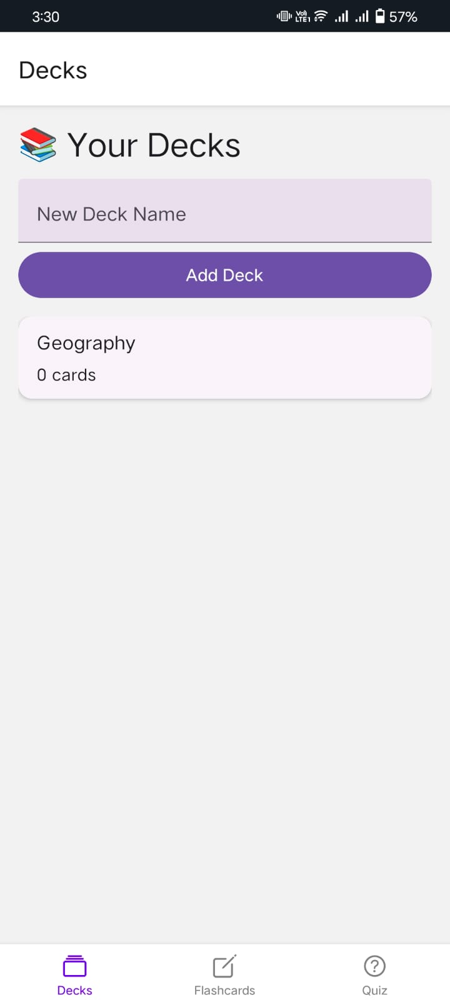
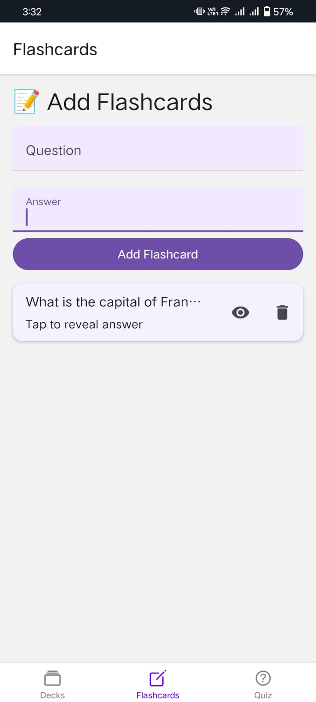
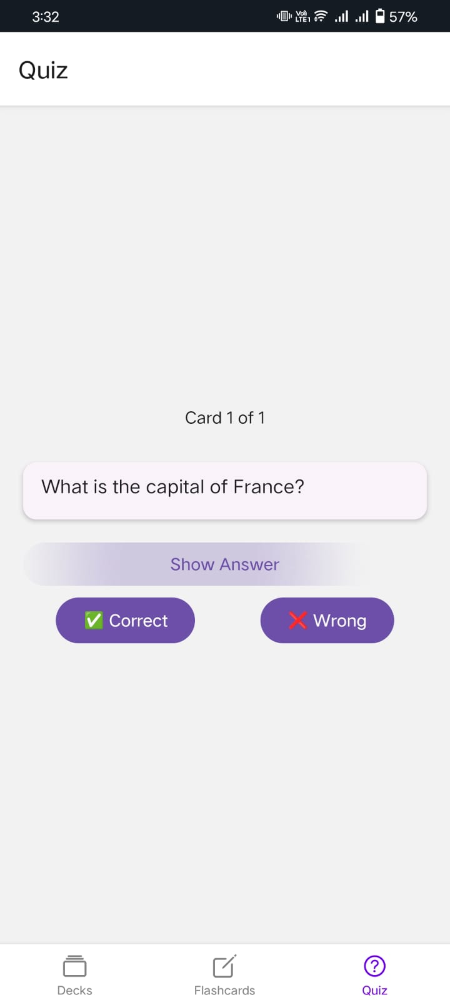

# 📚 Task 1 - Flashcard Quiz App (React Native + Expo)

A simple yet powerful **Flashcard Quiz App** built using **React Native** and **Expo**. This app lets users create flashcard decks, add questions, and take interactive quizzes to test their knowledge.

---

## ✨ Features

- ✅ Create multiple flashcard decks
- ✅ Add questions and answers to each deck
- ✅ Take quizzes on your decks
- ✅ Track your quiz progress
- ✅ Clean UI using React Native components
- ✅ TypeScript support

---

## 📸 Screenshots

> These images are stored in the `screenshots/` folder inside the repo.

### 🏠 Home / Deck List



### 📂 Deck Details Screen


### ➕ Add Flashcard


### 🔄 Show Answer Toggle



### 🧠 Quiz Start Screen



### ✅ Quiz Result


---

## 📦 Installation

### Prerequisites

- Node.js ≥ 14.x
- npm ≥ 6.x
- Expo CLI (`npm install -g expo-cli`)

### Steps

```bash
# Clone the repo
git clone https://github.com/Sahilkhanz/codealpha_task.git

# Navigate to the project folder
cd Task_1_flashcard-quiz

# Install dependencies
npm install

# Start the Expo dev server
npx expo start
```
